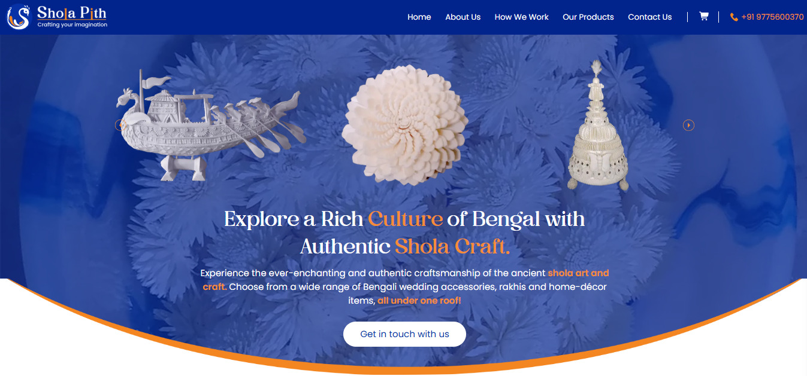
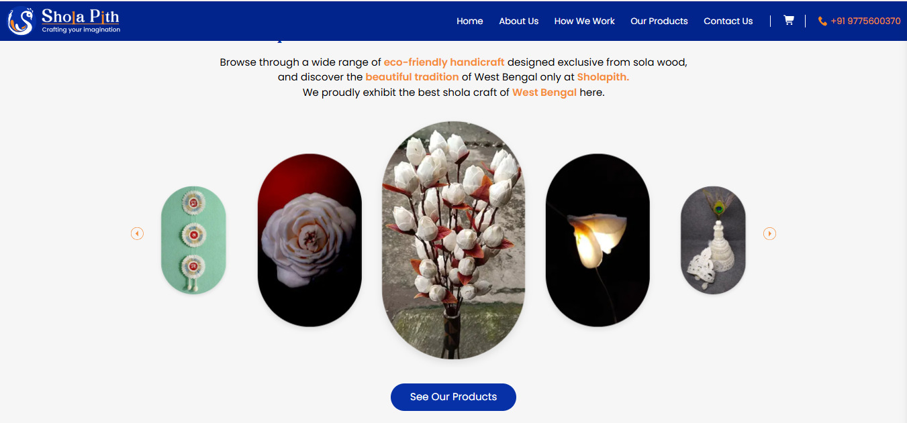

# 🛍️ Sholapith Handicrafts E-Commerce Platform

Welcome to a digital sanctuary for **Sholapith handicrafts** — a unique e-commerce platform dedicated to preserving and promoting the exquisite, yet fading, traditional art form of **Sholapith craft from West Bengal, India**.

---

## 🌿 About the Project

This platform serves as a curated marketplace for **authentic, handcrafted shola items** — including bridal mukuts, framed artworks, ceremonial boats, heritage figurines, and more. Each piece is a tribute to Bengal’s rich artisan culture, created by skilled rural craftsmen.

---

## 🎯 Purpose & Mission

- **Preservation & Awareness**  
  Reviving interest in this eco-friendly, symbolic, and culturally significant craft which is slowly disappearing.

- **Empowerment Through Visibility**  
  Giving rural artisans a modern digital platform to showcase and sell their creations directly to conscious buyers.

---

## 🖥️ Tech Stack

This frontend application is built with a modern, scalable stack focused on performance and developer experience:

- **Next.js** – SSR-ready, SEO-friendly framework for performance and scalability  
- **React + Redux** – For component-driven architecture and global state management  
- **Tailwind CSS** – Utility-first CSS framework for rapid, responsive styling  
- **Next Router** – Dynamic routing across product pages and navigation flows  
- **Formik + Yup** – For building and validating the checkout form  
- **LocalStorage** – For persisting cart and order data

---

## ⚙️ Features

- 📦 Category-wise product listing  
- 🔍 Detailed product pages with images, quantity counter, and add-to-cart  
- 🛒 Redux-powered persistent cart  
- ✅ Checkout form with field validation  
- 💾 Local order storage and personalized thank-you page  
- 📱 Mobile-friendly cart drawer/popup

---

## 🌍 What is Sholapith?

**Sholapith** is a milky-white, spongy plant material used in traditional Bengali rituals and decor. Lightweight and intricately carvable, it’s used to create everything from wedding topors to cultural sculptures. This platform was built not just to sell, but to **revive and respect** this ancient eco-art.

---

## 📸 Screenshots

*Add product images, UI snapshots or gifs here to showcase functionality.*

--- 
--- 

## 📌 Future Enhancements

- Admin dashboard for artisan product uploads  
- Razorpay/Stripe payment gateway integration  
- Order history and shipping management  
- CMS integration for blogs and awareness content

---

## 📬 Contact

For collaborations, artisan partnerships, or custom orders, feel free to connect:

**Email:** nupur.sholapith@gmail.com  
**Website:** [sholapith.com](https://sholapith.com)

---

> *“Crafted by hand, powered by code.”*  
> – A tribute to timeless tradition in a digital world.
